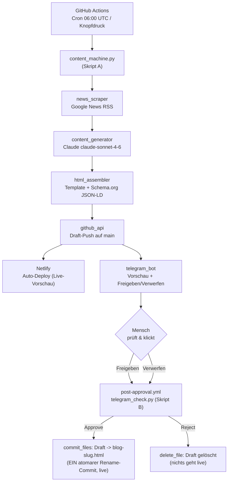

# Technischer Plan — Insektenblitz Content-Maschine

Vollautomatische Content-Pipeline: erzeugt täglich einen SEO-optimierten EPS-Blogpost
und schaltet ihn nach menschlicher Telegram-Freigabe live auf der Website.

## 1. Architektur

Zwei getrennte, zustandslose Actions-Läufe: **Skript A** erzeugt + pusht den Draft und
sendet die Telegram-Vorschau; **Skript B** (15-Min-Cron + Knopfdruck) wertet den
Freigabe-Klick aus. Der offene Draft wird zustandsfrei aus dem Repo ermittelt
(Repo = Quelle der Wahrheit), der Slug kommt aus der Telegram-`callback_data`.

## 2. APIs & Tools

- **Python 3.11** — gesamte Pipeline.
- **GitHub Actions** — Scheduling (Cron) + manueller Trigger (`workflow_dispatch`).
- **Anthropic Claude API** (`claude-sonnet-4-6`) — schreibt den Beitrag (Structured Outputs).
- **Telegram Bot API** — Vorschau-Nachricht mit Freigeben/Verwerfen-Buttons.
- **GitHub REST API** — Contents-API (Draft-Push, Verzeichnis-Listing) + Git Data API (atomarer Multi-Datei-Commit beim Approve).
- **Netlify** — Auto-Deploy bei jedem Push auf `main` (kein Build-Step, kein Token nötig).
- **Dependencies** (`requirements.txt`): `requests`, `anthropic`, `defusedxml` (härtet RSS-Parsing gegen XXE/Entity-Bomben).

## 3. Rechtssicherheit

- **Vollständige Umschreibung durch Claude** — kein Copy-Paste von Originaltexten.
- **Quellenangabe pro Post** (Medien-Name als `source_label`, keine Redirect-URLs).
- **Keine Fotos** von Nachrichtenseiten; **keine Verleumdung**.
- **Öffentliches Repo ohne echte Keys** — alle Zugangsdaten ausschließlich als GitHub
  Secrets (`${{ secrets.* }}`), nie im Code oder in der Git-History. `.env`/`.planning/`
  sind gitignored.
- **Push via eingebautes `GITHUB_TOKEN`** mit `permissions: contents: write` (least-privilege),
  kein langlebiges Personal Access Token.

## 4. Skalierbarkeit / Phase-2-Ausblick

Aufgeschobene v2-Erweiterungen (aus REQUIREMENTS.md):
- **Zielgruppen-Kategorisierung** der Posts (Kinder/Schulen/Behörden/Büros/Seniorenheime).
- **`/blog`-Filter-UI** für die kategorisierten Beiträge.
- **Weitere Quellen** via OAuth (Reddit) bzw. Firecrawl-Volltext-Recherche für bessere Qualität.
- **Sitemap-Auto-Update + interne Verlinkung** → schnellere Google-Indexierung.
- **FAQ-/Long-Tail-Inhalte** für zusätzlichen SEO-Hebel.

## 5. Offene Risiken & Abhängigkeiten

- **Cron-Verzögerung öffentlicher Repos** (5–30 Min Verspätung möglich) — am Demo-Tag Puffer einplanen.
- **Reddit 403 ohne OAuth** — Quelle fällt sauber aus, Google News trägt die Generierung.
- **Übergabe** braucht Maltes Repo-Zugriff (Collaborator) + seine eigenen Secrets.
- **404-Randfall bei Offset-Race** (Approve verarbeitet, Offset-Bestätigung schlägt fehl) —
  dokumentiert akzeptiert: Post ist live, nur der Actions-Log zeigt einen roten Lauf.
